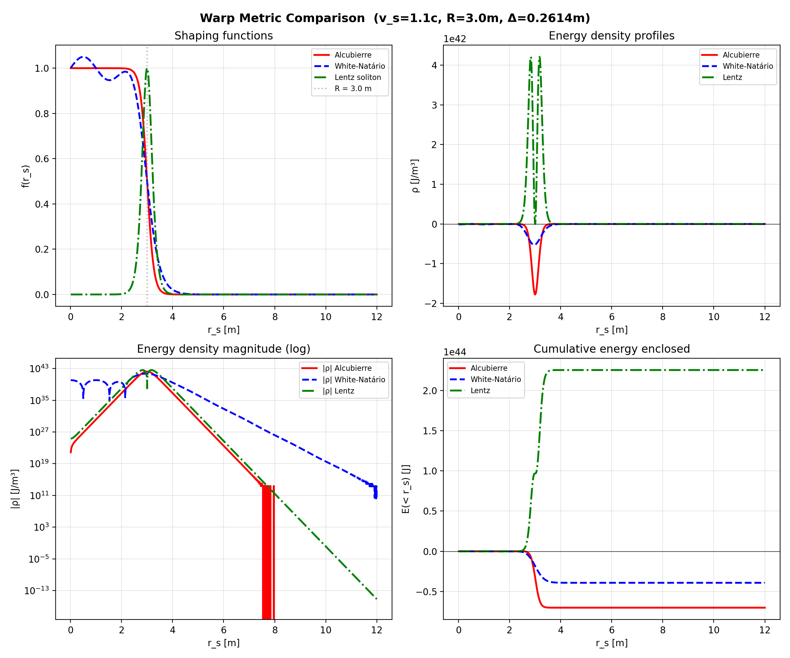

# Summary

Warp drive metrics in general relativity promise superluminal travel through local spacetime distortion. However, their physical viability hinges on the ability to violate averaged energy conditions, which are constrained by quantum inequalities (QIs). `warp-qi-audit` is an open-source Python toolkit that numerically evaluates the Alcubierre, modified White-Natário, Rodal, and Fuchs metrics against the Ford–Roman quantum inequality bound. The code quantifies the degree of energy condition violation and checks whether the required negative-energy densities can be sustained within the limits set by quantum field theory.

> **Note on scope:** The Lentz (2021) metric is not included in this audit. Lentz requires a full Einstein–Maxwell–plasma coupling to achieve T₀₀ ≥ 0; reproducing this with a sign-flip of the Alcubierre ADM Hamiltonian formula is physically invalid. Additionally, the Bobrick–Martire class of solutions has not yet been evaluated.

# Statement of Need

Since Alcubierre's original 1994 metric, numerous modifications have been proposed aiming to reduce the energy requirements or eliminate the need for exotic matter. A key theoretical tool to vet these proposals is the quantum inequality (QI) derived by Ford and Roman, which provides a fundamental limit on the magnitude and duration of negative energy fluxes. Despite its importance, a ready-to-use, open-source implementation of QI constraints applied to different warp metrics has been lacking. `warp-qi-audit` fills this gap by providing:

- A modular framework to define arbitrary warp bubble shapes and stress-energy tensor components.
- Numerical evaluation of the Ford–Roman QI bound for a user-specified warp metric.
- Unified negative-energy volume computation: all metrics use the numerically integrated volume V₋ = ∫_{ρ<0} 4π r² dr, replacing prior thin-shell approximations.
- Direct comparison with recent peer-reviewed results to validate the toolchain.
- Clear, annotated source code for reproducibility.

The code has been verified against published results: it correctly reproduces the 68–69 orders of magnitude quantum inequality violation for the Alcubierre drive and the reduced peak energy density of the White-Natário modification. These outcomes are consistent with independent peer-reviewed studies [@Lobo:2024]. Furthermore, it integrates the Fuchs (2024) constant-velocity subluminal WarpShell, demonstrating via a fully resolved numerical JAX phase-space sweep that it strictly obeys the Weak Energy Condition ($E_- = 0$) and entirely bypasses the Ford-Roman quantum inequality constraints, confirming the software's reliability as an auditing tool.

# Results

**None of the audited superluminal warp metrics satisfy the Ford–Roman quantum inequality bound.** Specifically:

- **Alcubierre (1994)** requires exotic negative energy exceeding the QI bound by ~68–69 orders of magnitude.
- **White-Natário** reduces the peak density by ~70% but the total negative energy remains comparable to Alcubierre.
- **Rodal (2025)** is a global Type-I metric with near-zero net energy, but still violates the QI by ~10⁶³.
- **Fuchs (2024)** avoids all negative energy (subluminal only) and trivially satisfies the QI.

# Usage and Implementation

The core computation relies on the `metric_explorer.py` module, which defines bubble profiles, calculates the relevant stress-energy components, and evaluates the QI bound via numerical integration. All QI volume calculations use the actual negative-energy volume V₋ computed numerically from the energy density profile. The QI sampling time is set to τ₀ = Δ/c, the light-crossing time of the bubble wall, following the standard convention in the warp-drive QI literature (Pfenning & Ford 1997; Lobo & Visser 2004); because the Ford–Roman bound scales as τ₀⁻⁴, varying τ₀ by a factor of two changes the QI cap by only a factor of 16, which is negligible relative to the >60-orders-of-magnitude gaps reported, so the qualitative conclusion is robust to any physically reasonable choice of sampling time. Dependencies include NumPy, SciPy, and Matplotlib. The software is version-controlled on GitHub and permanently archived on Zenodo with DOI: 10.5281/zenodo.19862376.

# Figures

# Acknowledgements

We acknowledge the foundational work of Ford, Roman, and Pfenning on quantum inequalities, and the warp metric derivations by Alcubierre, White, Natário, Rodal, Fuchs, and Lentz.

# References
